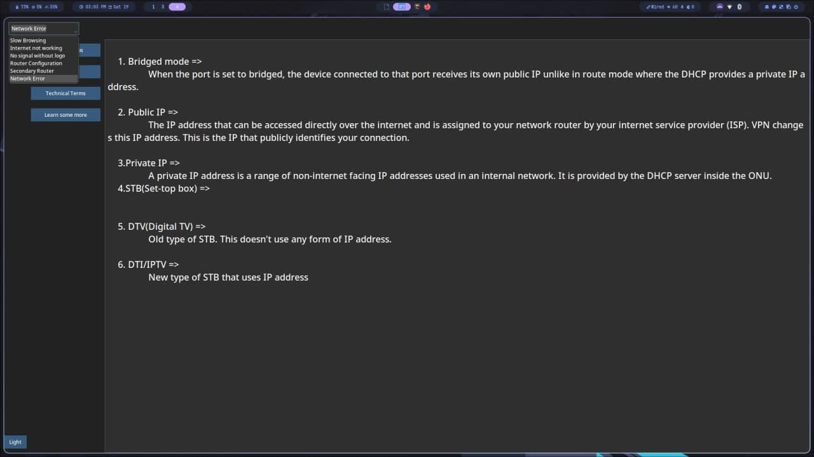
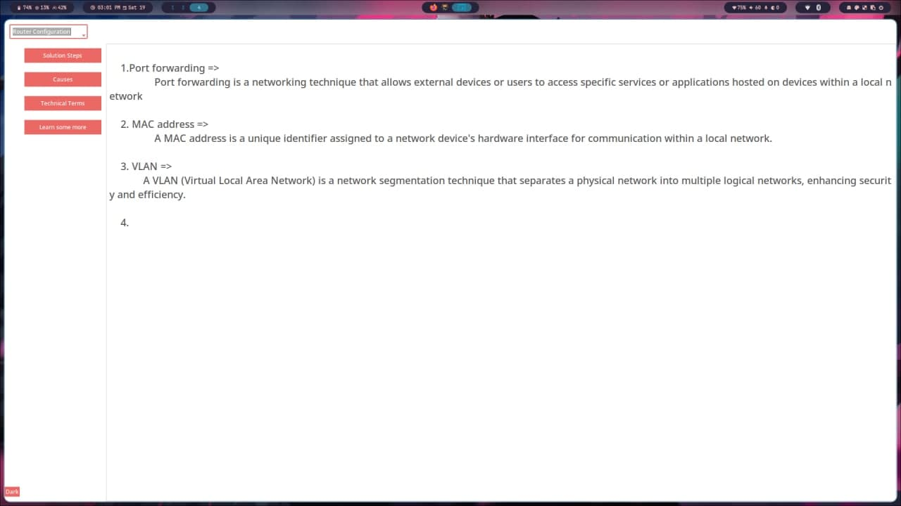

# _subisuTSC_
An application for learners at Subisu TSC

## Installation
### Linux
1. Download the binary from the releases tab.
2. Make the binary excutable either from the GUI or `chmod +s Subisu`
3. Execute the binary.

### Windows
1. Download the executable from the releases tab.
2. Install the exe.

## Screenshots





## Contribution
If you want to contribute to the code you can fork this project and go crazy with it.

### How to?
#### Requirements
```
python
pip
tkinter
ttkthemes
ttkbootstrap
pyinstaller
```

#### Process
1. Install python
2. Open a terminal where you want this project to exist
3. Run the following commands:
   ```
   cd subisuTSC/
   pip install -r requirements.py
   ```
4. Modify the code in Subisu.py
5. Use pyinstaller to  bundle up the code into executable binary
   `pyinstaller --onefile --noconsole Subisu.py`
6. The modified app will be inside the `dist/` folder

## Support

For support, email kastisuhesh1@gmail.com.


## License

[MIT](https://choosealicense.com/licenses/mit/)

